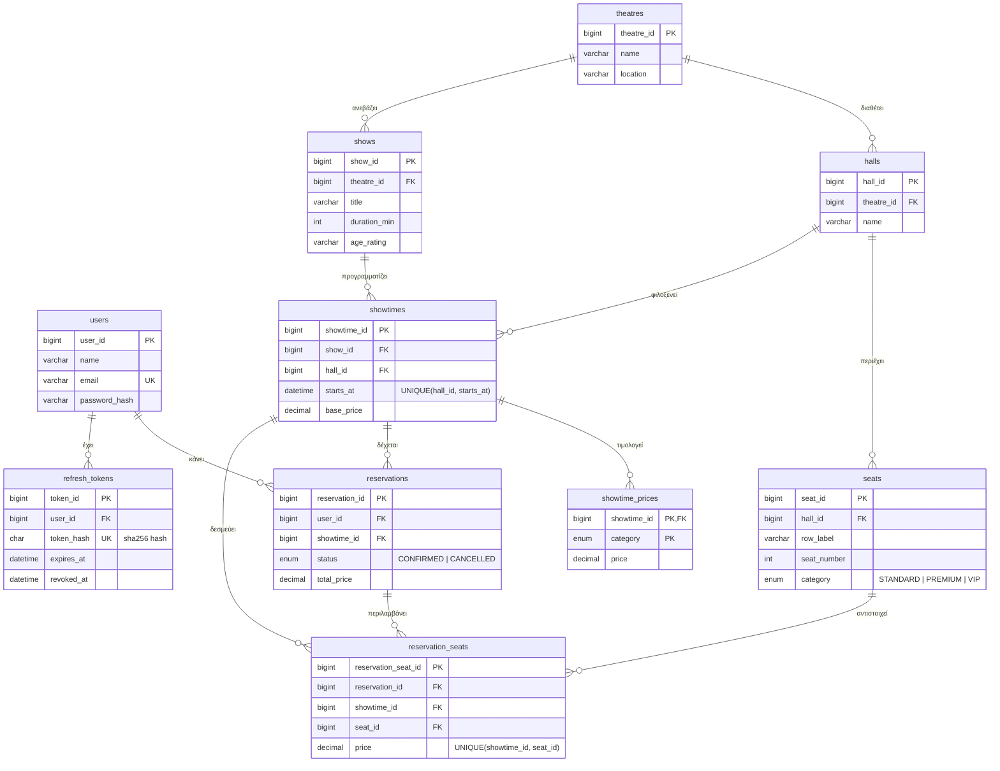
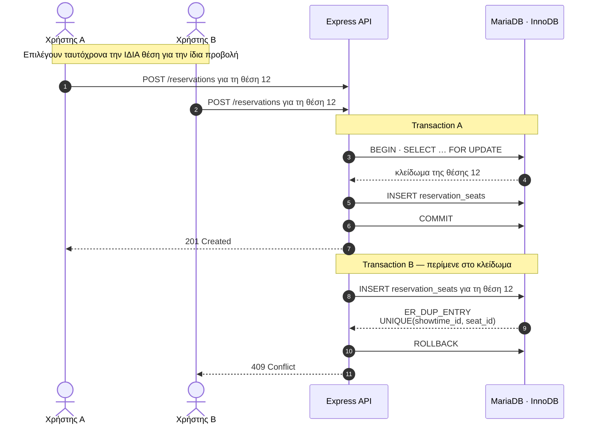

<div align="center">

# 🎭 Spotlight — Κράτηση Θέσεων σε Θεατρικές Παραστάσεις

**Μια full-stack εφαρμογή κινητού για να ψάχνεις θέατρα και παραστάσεις και να κλείνεις θέσεις σε πραγματικό χρόνο.**

Εργασία για το μάθημα **CN6035 — Mobile & Distributed Systems**

👤 Δημιουργός: **Χαράλαμπος Στίκος** · 🏷️ Έκδοση **1.1.0**


</div>

---

## 📖 Περιγραφή

Το **Spotlight** είναι μια εφαρμογή κινητού όπου ο χρήστης μπορεί να **περιηγηθεί** σε θέατρα και παραστάσεις, να διαλέξει **ημερομηνία και ώρα** από έναν σύγχρονο επιλογέα και να **κρατήσει τις θέσεις που θέλει** μέσα από έναν διαδραστικό χάρτη αίθουσας — με **πλήρες dark mode** και απτική ανάδραση σε κάθε σημαντική ενέργεια.

Από κάτω κρύβεται ένα κλασικό **κατανεμημένο σύστημα τριών επιπέδων**. Ένας **mobile client** σε React Native μιλάει μέσω ενός **REST API** σε Node.js και Express με μια **βάση δεδομένων** MariaDB. Έτσι καλύπτονται οι βασικές έννοιες του μαθήματος — **ταυτοποίηση και εξουσιοδότηση με JWT**, **συνέπεια δεδομένων** και **διαχείριση ταυτόχρονων κρατήσεων**.

```mermaid
flowchart LR
    subgraph CLIENT["Mobile Client · React Native + Expo"]
        direction TB
        SCR["Οθόνες · Πλοήγηση<br/>Discover · Search · ShowDetails<br/>SeatMap · Tickets · Profile"]
        CTX["Contexts<br/>Auth · Favorites · Recent · Badge · Theme"]
        APIC["API client · axios<br/>interceptors: Bearer JWT + auto-refresh"]
        SEC["expo-secure-store<br/>keychain / keystore"]
        SCR --> CTX
        CTX --> APIC
        CTX -. tokens & προτιμήσεις .-> SEC
    end

    subgraph SERVER["REST API · Node.js / Express"]
        direction TB
        MW["Middleware<br/>helmet · CORS · rate-limit<br/>JWT auth · Zod validate · error handler"]
        RTE["Routes /api"]
        CTL["Controllers"]
        SVC["Services<br/>business logic + transactions"]
        MW --> RTE
        RTE --> CTL
        CTL --> SVC
    end

    subgraph DATA["Database · MariaDB 11.4 σε Docker"]
        direction TB
        POOL["mysql2 connection pool"]
        TBL["InnoDB tables<br/>10 σχετιζόμενοι πίνακες"]
        POOL --> TBL
    end

    APIC -->|"HTTPS / JSON · Bearer JWT"| MW
    SVC -->|"SQL · FOR UPDATE · transactions"| POOL
```



<div align="center"><sub><b>ο πελάτης</b> ──▶ <b>ο εξυπηρετητής</b> ──▶ <b>τα δεδομένα</b> — κατανεμημένο σύστημα τριών επιπέδων</sub></div>

---

## 📑 Πίνακας περιεχομένων

- [✨ Λειτουργίες](#-λειτουργίες)
- [🆕 Τι νέο υπάρχει στην έκδοση 1.1.0](#-τι-νέο-υπάρχει-στην-έκδοση-110)
- [🧱 Τεχνολογίες](#-τεχνολογίες)
- [📁 Δομή αποθετηρίου](#-δομή-αποθετηρίου)
- [✅ Προαπαιτούμενα](#-προαπαιτούμενα)
- [🚀 Εγκατάσταση & εκτέλεση](#-εγκατάσταση--εκτέλεση)
- [📱 Δοκιμή σε πραγματική συσκευή](#-δοκιμή-σε-πραγματική-συσκευή)
- [🗺️ Οθόνες & εμπειρία χρήστη](#️-οθόνες--εμπειρία-χρήστη)
- [🔌 API Reference](#-api-reference)
- [🧪 Δοκιμές του API — Postman & newman](#-δοκιμές-του-api--postman--newman)
- [🗄️ Σχεδιασμός βάσης δεδομένων](#️-σχεδιασμός-βάσης-δεδομένων)
- [🔒 Έλεγχος ταυτόχρονων κρατήσεων](#-έλεγχος-ταυτόχρονων-κρατήσεων)
- [🔐 Ασφάλεια & ταυτοποίηση](#-ασφάλεια--ταυτοποίηση)
- [🛠️ Επίλυση προβλημάτων](#️-επίλυση-προβλημάτων)
- [🔮 Μελλοντικές επεκτάσεις](#-μελλοντικές-επεκτάσεις)

---

## ✨ Λειτουργίες

### 👤 Χρήστης & ταυτοποίηση
- **Εγγραφή και σύνδεση** με email και κωδικό, με **JWT access tokens** και **rotating refresh tokens**.
- Τα tokens αποθηκεύονται **με ασφάλεια** στο keychain της συσκευής μέσω `expo-secure-store` και **ανανεώνονται αυτόματα** μόλις λήξει το access token.
- **Περιήγηση ως επισκέπτης**: η εφαρμογή ανοίγει κατευθείαν στην Ανακάλυψη και η σύνδεση ζητείται μόνο τη στιγμή της κράτησης ή στις καρτέλες Εισιτήρια και Προφίλ.

### 🎬 Αναζήτηση & περιήγηση
- **Ανακάλυψη**: χαιρετισμός ανάλογα με την ώρα, προβεβλημένο carousel που αλλάζει μόνο του, φίλτρα ανά πόλη, πλέγμα με αφίσες και ράφια **Πρόσφατα**, **Αγαπημένα** και **Για εσένα**.
- **Αναζήτηση** με βάση τον τίτλο της παράστασης, το όνομα του θεάτρου ή την τοποθεσία — με **πρόσφατες αναζητήσεις** που αποθηκεύονται στη συσκευή και κουμπί καθαρισμού.
- **Αγαπημένα ♥**: αποθηκεύονται τοπικά στη συσκευή και δουλεύουν ακόμη και χωρίς λογαριασμό.

### 🎟️ Λεπτομέρειες & κράτηση
- **Σελίδα παράστασης** με parallax εικόνα, διάρκεια, καταλληλότητα, τιμοκατάλογο ανά κατηγορία και περίληψη.
- **Επιλογέας ημερομηνίας & ώρας**: οριζόντια date chips (TODAY / TMRW / FRI…) με τις ώρες της επιλεγμένης μέρας από κάτω — και sticky κουμπί **«Book tickets»** που ανοίγει το ίδιο σε **bottom sheet**, χωρίς άβολα scroll.
- **Διαδραστικός χάρτης θέσεων** με χρωματικό κώδικα ανά κατηγορία — Standard, Premium, VIP — τιμές στο υπόμνημα και ζωντανό σύνολο.
- **«Καλύτερη διαθέσιμη» για παρέα**: επιλέγεις πόσα άτομα είστε (1–8) και η εφαρμογή βρίσκει τις καλύτερες **συνεχόμενες** θέσεις στην ίδια σειρά.
- **Επιβεβαίωση κράτησης** με εορταστικό confetti και απτική ανάδραση.

### 📋 Διαχείριση κρατήσεων & προφίλ
- **Ιστορικό κρατήσεων** χωρισμένο σε **Επερχόμενες** — με αντίστροφη μέτρηση «Today / Tomorrow / In X days» — και **Ιστορικό**.
- **Ακύρωση**, **αλλαγή θέσεων** ή **κοινοποίηση** του εισιτηρίου για τις μελλοντικές κρατήσεις.
- Εισιτήριο σε στυλ **boarding pass**, με barcode, αποκόμματα και κωδικό κράτησης.
- **Προφίλ** με στατιστικά σε «αιωρούμενη» κάρτα, αγαπημένα, πρόσφατα και ομαδοποιημένες ενότητες Preferences / Account.

### 🎨 Εμφάνιση & αίσθηση
- **Dark mode**: επιλογή **System / Light / Dark** από το Προφίλ, με αποθήκευση της προτίμησης — δύο πλήρεις παλέτες («Sunset» και «Midnight»).
- **Απτική ανάδραση** (haptics) σε επιλογή θέσης, αγαπημένα, φίλτρα και επιτυχία/αποτυχία κράτησης.
- **Συνεπής πλοήγηση**: όλες οι εσωτερικές οθόνες χρησιμοποιούν το standard header του συστήματος με το native κουμπί επιστροφής.

---

## 🆕 Τι νέο υπάρχει στην έκδοση 1.1.0

| Κατηγορία | Αλλαγή |
|-----------|--------|
| 🌗 Θέμα | Πλήρες **dark mode** (System / Light / Dark) με themed design tokens σε όλη την εφαρμογή |
| 🗓️ Κράτηση | Νέος **επιλογέας ημερομηνίας & ώρας** με date chips και **bottom sheet** από το sticky CTA |
| 👥 Θέσεις | **Best available για παρέα** — εύρεση 1–8 **συνεχόμενων** θέσεων στην ίδια σειρά |
| 🧭 Πλοήγηση | Ενιαία **system headers** με native back σε όλες τις εσωτερικές οθόνες |
| 👤 Προφίλ | Πλήρης ανασχεδίαση με stats card, ενότητες Preferences/Account και επιλογέα θέματος |
| 📳 UX | Haptics, χαιρετισμός ανά ώρα, πρόσφατες αναζητήσεις, countdown εισιτηρίων, share εισιτηρίου |
| 🧪 Δοκιμές | **Αυτορυθμιζόμενη συλλογή Postman** με 47 assertions — τρέχει πράσινη με `newman` |
| 🌱 Δεδομένα | Οι ημερομηνίες του seed είναι πλέον **σχετικές με την ημέρα φόρτωσης** — το demo δεν «λήγει» ποτέ |

---

## 🧱 Τεχνολογίες

| Επίπεδο | Τεχνολογίες |
|--------|-------------|
| **Frontend** | React Native με Expo SDK 54 σε JavaScript, React Navigation 7 με bottom tabs και native stacks, axios, expo-secure-store, expo-linear-gradient, expo-haptics, expo-constants |
| **Backend** | Node.js με Express σε ES modules, mysql2, jsonwebtoken, bcryptjs, zod, helmet, cors, express-rate-limit, morgan |
| **Database** | MariaDB 11.4 με InnoDB πάνω σε Docker, μαζί με το γραφικό περιβάλλον Adminer |
| **Εργαλεία** | Docker Compose, Postman & newman, Git και GitHub, WebStorm |

> 🎨 Όλα τα animations — carousel, count-up, confetti, seat pop, skeleton loaders — είναι φτιαγμένα με το ενσωματωμένο **`Animated` API** του React Native, χωρίς καμία επιπλέον native εξάρτηση, ώστε να τρέχουν απρόσκοπτα μέσα στο Expo Go.

---

## 📁 Δομή αποθετηρίου

```
Spotlight/
├─ frontend/                      Εφαρμογή React Native με Expo
│  ├─ App.js                      Providers (Theme, Auth, Favorites, Recent, Badge) + πλοήγηση
│  ├─ app.json                    Ρυθμίσεις Expo · extra.apiUrl / extra.apiPort για το backend
│  └─ src/
│     ├─ api/                     axios client και endpoints για auth, catalog, reservations
│     ├─ components/              UI kit — Button, Card, Cover, Segmented, ShowtimePicker, Confetti…
│     ├─ context/                 Contexts — Auth, Favorites, RecentlyViewed, Badge
│     ├─ navigation/              RootNavigator: 4 καρτέλες, system headers, auth modals
│     ├─ screens/                 Discover, Search, ShowDetails, SeatMap, Tickets, Profile…
│     ├─ storage/                 secureStore (tokens) · local (προτιμήσεις, με κεντρικά κλειδιά)
│     ├─ theme/                   theme.js (παλέτες light/dark, tokens) · ThemeContext (makeStyles)
│     └─ utils/                   format, errors, haptics, cover
├─ backend/                       REST API με Express
│  ├─ src/  config/ · routes/ · controllers/ · services/ · middleware/ · validators/ · utils/
│  ├─ requests.http               αυτορυθμιζόμενα requests για το WebStorm HTTP Client
│  └─ postman/Spotlight.postman_collection.json   συλλογή με test assertions (βλ. Δοκιμές)
└─ database/                      schema.sql · seed.sql (σχετικές ημερομηνίες) · docker-compose.yml
```

---

## ✅ Προαπαιτούμενα

- **Node.js** 18+ και npm
- **Docker Desktop** για τη MariaDB — ή μια τοπική εγκατάσταση **MariaDB**, με οδηγίες στην ενότητα «Χωρίς Docker» παρακάτω
- Την εφαρμογή **Expo Go** στο κινητό, από το App Store ή το Google Play — εναλλακτικά έναν Android emulator
- Κινητό και υπολογιστή στο **ίδιο δίκτυο Wi-Fi**

---

## 🚀 Εγκατάσταση & εκτέλεση

### 🔐 Μεταβλητές περιβάλλοντος `.env` — διάβασέ το πρώτα

Το project κρατάει τις ρυθμίσεις του — τους κωδικούς της βάσης και τα μυστικά του JWT — σε αρχεία **`.env`**. Για λόγους ασφάλειας αυτά τα αρχεία **δεν** ανεβαίνουν στο Git, γι' αυτό και θα βρεις έτοιμα παραδείγματα **`.env.example`** που απλώς τα **αντιγράφεις** σε `.env`.

| Αρχείο | Φάκελος | Χρειάζεται; | Τι ρυθμίζει |
|--------|---------|:-----------:|-------------|
| `backend/.env` | `backend/` | **Ναι, υποχρεωτικό** | Θύρα, στοιχεία σύνδεσης στη βάση και μυστικά JWT. Χωρίς αυτό το backend δεν ξεκινάει καν. |
| `database/.env` | `database/` | Όχι, προαιρετικό | Αλλάζει τους κωδικούς της MariaDB στο Docker. Αν λείπει, ισχύουν οι προεπιλογές από το `docker-compose.yml`. |

> ✅ **Τα καλά νέα:** τα `.env.example` έρχονται με έτοιμες, λειτουργικές προεπιλογές που ταιριάζουν με το Docker. Για τοπική δοκιμή αρκεί να αντιγράψεις το `backend/.env.example` σε `backend/.env`, κάτι που γίνεται στο βήμα 2️⃣, και δεν χρειάζεται να αλλάξεις ούτε μία τιμή.

> ⚠️ **Ο μόνος κανόνας που πρέπει να θυμάσαι:** τα στοιχεία της βάσης `DB_USER`, `DB_PASSWORD` και `DB_NAME` πρέπει να είναι ίδια στο `backend/.env` και στη βάση σου, είτε στο `database/.env` του Docker είτε στην τοπική σου MariaDB. Με τις προεπιλογές είναι ήδη ίδια: `spotlight`, `spotlightpass`, `spotlight`.

> 📱 Το **frontend δεν θέλει `.env`**. Βρίσκει μόνο του τη διεύθυνση του backend από τον host του Expo — και αν χρειαστεί, την προσαρμόζεις από το `frontend/app.json` (`extra.apiUrl` για πλήρη διεύθυνση ή `extra.apiPort` για άλλη θύρα).

**Με δυο λόγια, ανάλογα με το πώς θα τρέξεις το project:**
- **Με Docker, που είναι και το προτεινόμενο:** δεν αγγίζεις κανένα `.env` της βάσης. Κάνεις μόνο `copy backend\.env.example backend\.env` και είσαι έτοιμος, αφού οι προεπιλογές ταιριάζουν με το Docker.
- **Χωρίς Docker, με τοπική MariaDB:** αντιγράφεις το `backend/.env` το ίδιο, αλλά προσαρμόζεις τα `DB_USER` και `DB_PASSWORD` ώστε να ταιριάζουν με τον χρήστη που έφτιαξες στη MariaDB. Τα λέω αναλυτικά στην ενότητα «Χωρίς Docker», στο βήμα 4.

---

### 1️⃣ Βάση δεδομένων με Docker — αναλυτικός οδηγός για αρχάριους

**Τι είναι το Docker;** Ένα εργαλείο που τρέχει τη βάση δεδομένων μέσα σε ένα έτοιμο, απομονωμένο «κουτί», το λεγόμενο container. Έτσι **δεν χρειάζεται να εγκαταστήσεις ή να ρυθμίσεις μόνος σου** τη MariaDB — το Docker φορτώνει αυτόματα και τους πίνακες και τα δεδομένα.

#### α. Κατέβασμα και εγκατάσταση του Docker Desktop
1. Πήγαινε στο **<https://www.docker.com/products/docker-desktop/>** και πάτα **«Download Docker Desktop»** για Windows, ή για Mac ανάλογα με το σύστημά σου.
2. Τρέξε το αρχείο που κατέβηκε, το **`Docker Desktop Installer.exe`**. Στην εγκατάσταση **άφησε τσεκαρισμένη** την επιλογή **«Use WSL 2 instead of Hyper-V»** και πάτα **OK / Install**.
3. Όταν τελειώσει, κάνε **επανεκκίνηση** του υπολογιστή αν σου το ζητήσει.
   > 💡 Αν εμφανιστεί μήνυμα ότι λείπει το **WSL 2**, άνοιξε το **PowerShell ως διαχειριστής** με δεξί κλικ και «Εκτέλεση ως διαχειριστής», τρέξε `wsl --install` και κάνε επανεκκίνηση.

#### β. Ξεκίνα το Docker Desktop — πρέπει να «τρέχει»
1. Άνοιξε την εφαρμογή **Docker Desktop** από το Start Menu.
2. Περίμενε λίγο μέχρι να γράψει κάτω αριστερά **«Engine running»** και το εικονίδιο της φάλαινας 🐳 στη γραμμή εργασιών να σταματήσει να κινείται.
   > ⚠️ Το Docker Desktop πρέπει να είναι **ανοιχτό και ενεργό κάθε φορά** που δίνεις εντολές `docker`. Αλλιώς θα δεις ένα σφάλμα του στιλ *«Cannot connect to the Docker daemon»*.
3. Για να σιγουρευτείς ότι δουλεύει, άνοιξε **PowerShell** και τρέξε:
   ```powershell
   docker --version
   docker ps
   ```
   Αν δεν βγάλει σφάλμα, είσαι έτοιμος. Αν σου πει «το docker δεν αναγνωρίζεται…», κλείσε και ξανάνοιξε το PowerShell, ή κάνε μια επανεκκίνηση μετά την εγκατάσταση.

#### γ. Ξεκίνα τη βάση δεδομένων
```powershell
cd Spotlight\database
docker compose up -d
```
- **Την πρώτη φορά** το Docker κατεβάζει τις εικόνες της MariaDB και του Adminer. Θέλει **σύνδεση στο internet** και μπορεί να πάρει 1–3 λεπτά. Τις επόμενες φορές ξεκινάει στο πι και φι.
- Το `-d` τρέχει τη βάση στο **παρασκήνιο**. Τα `schema.sql` και `seed.sql` φορτώνονται **αυτόματα** την πρώτη φορά.
- 🌱 Οι ημερομηνίες των προβολών στο seed είναι **σχετικές με την ημέρα φόρτωσης** — το ρεπερτόριο έχει πάντα μελλοντικές προβολές, όποτε κι αν στήσεις το project.
- **Δεν χρειάζεται** να φτιάξεις `database/.env` — το `docker-compose.yml` έχει ήδη έτοιμες προεπιλογές. Βάλε ένα μόνο αν θες να αλλάξεις τους κωδικούς, και τότε άλλαξέ τους **και** στο `backend/.env`.

#### δ. Επιβεβαίωσε ότι όλα δουλεύουν
```powershell
docker ps
```
Πρέπει να δεις δύο containers να τρέχουν, το **`spotlight-mariadb`** και το **`spotlight-adminer`**.
- Βάση → `localhost:3306`, με βάση `spotlight`, χρήστη `spotlight` και κωδικό `spotlightpass`.
- Γραφικό περιβάλλον **Adminer** → άνοιξε το <http://localhost:8080> και βάλε System **MySQL**, Server **db**, Username **spotlight**, Password **spotlightpass**. Θα δεις τους πίνακες με τα δεδομένα.

#### ε. Χρήσιμες εντολές — από τον φάκελο `database/`
```powershell
docker compose stop        # σταματά τη βάση και κρατά τα δεδομένα
docker compose up -d       # την ξαναξεκινά
docker compose down        # σταματά και αφαιρεί τα containers, αλλά κρατά τα δεδομένα
docker compose down -v     # σβήνει ΚΑΙ τα δεδομένα — το επόμενο «up» ξαναφορτώνει schema και seed
```

---

### 🐬 Εναλλακτικά: χωρίς Docker, με τοπική MariaDB

Αν **δεν έχεις Docker**, στήνεις τη βάση με μια τοπική εγκατάσταση MariaDB. Κάνε **μόνο αυτό το βήμα** αντί για το 1️⃣ και μετά συνέχισε κανονικά με τα βήματα 2️⃣ και 3️⃣.

> ⚠️ Θέλει **MariaDB**, όχι MySQL — το `seed.sql` χρησιμοποιεί τη μηχανή **SEQUENCE** με το `seq_1_to_8`, που υπάρχει μόνο στη MariaDB.

**1. Εγκατάσταση της MariaDB**
- **Windows:** κατέβασε τον installer από το <https://mariadb.org/download/>. Κατά την εγκατάσταση:
  - όρισε **κωδικό για τον χρήστη `root`** και σημείωσέ τον,
  - άφησε ενεργό το **«Install as service»**, ώστε να τρέχει αυτόματα στη θύρα **3306**,
  - αν θέλεις, εγκατέστησε και το **HeidiSQL** για γραφικό περιβάλλον.
- **macOS:** `brew install mariadb && brew services start mariadb`
- **Linux σε Debian ή Ubuntu:** `sudo apt install mariadb-server && sudo systemctl start mariadb`

**2. Φτιάξε τον χρήστη της εφαρμογής** — σύνδεσου ως `root` και τρέξε τις εντολές SQL:
```sql
-- Στα Windows, άνοιξε από το Start Menu το «MariaDB Command Prompt» και τρέξε:  mysql -u root -p
CREATE USER IF NOT EXISTS 'spotlight'@'localhost' IDENTIFIED BY 'spotlightpass';
GRANT ALL PRIVILEGES ON spotlight.* TO 'spotlight'@'localhost';
FLUSH PRIVILEGES;
EXIT;
```
> Εναλλακτικά, παράλειψε αυτό το βήμα και χρησιμοποίησε απευθείας τον χρήστη `root` — απλώς βάλε τα στοιχεία του `root` στο `.env`, στο βήμα 4.

**3. Φόρτωσε το σχήμα και τα δεδομένα** — από τον φάκελο `database/`

- **Windows με PowerShell:** το PowerShell **δεν** υποστηρίζει το `<`. Σύνδεσου στον client και χρησιμοποίησε την εντολή `SOURCE` με **forward slashes**:
  ```powershell
  mysql -u root -p --default-character-set=utf8mb4
  ```
  και μέσα στο prompt της MariaDB:
  ```sql
  SOURCE C:/Spotlight/database/schema.sql;
  SOURCE C:/Spotlight/database/seed.sql;
  EXIT;
  ```
- **macOS, Linux ή cmd.exe στα Windows:**
  ```bash
  mysql -u root -p < database/schema.sql
  mysql -u root -p spotlight < database/seed.sql
  ```
> Το `schema.sql` περιέχει `CREATE DATABASE` και `USE`, οπότε δημιουργεί μόνο του τη βάση `spotlight` και τους πίνακες. Το `--default-character-set=utf8mb4` φροντίζει να φορτωθούν σωστά τα ελληνικά.

**4. Ρύθμισε το backend** — στο `backend/.env` βεβαιώσου ότι τα στοιχεία ταιριάζουν:
```ini
DB_HOST=127.0.0.1
DB_PORT=3306
DB_USER=spotlight          # ή root
DB_PASSWORD=spotlightpass  # ή ο κωδικός του root σου
DB_NAME=spotlight
```

**Για να επαναφέρεις ή να ανανεώσεις τα δεδομένα χωρίς Docker:** ξανατρέξε τα δύο scripts. Το `schema.sql` κάνει `DROP TABLE` και τα ξαναδημιουργεί, καθαρίζοντας τα πάντα.

**Για γραφικό περιβάλλον χωρίς το Adminer:** χρησιμοποίησε **HeidiSQL**, που έρχεται μαζί με τη MariaDB στα Windows, ή **DBeaver** ή **MySQL Workbench**, με Host `127.0.0.1` και port `3306`.

---

### 2️⃣ Backend — το Express API
```bash
cd backend
copy .env.example .env         # Windows  ·  σε macOS/Linux: cp .env.example .env
npm install
npm start                      # → http://localhost:4000
```
> 💡 Με το Docker, οι **προεπιλογές του `.env` δουλεύουν ως έχουν και δεν θέλουν καμία αλλαγή**. Χωρίς Docker, προσάρμοσε πρώτα τα `DB_*` όπως στην ενότητα «Χωρίς Docker», βήμα 4.

Για να δεις ότι λειτουργεί, άνοιξε το http://localhost:4000/health και θα πάρεις `{"status":"ok",...}`.

### 3️⃣ Frontend — το React Native
```bash
cd frontend
npm install
npx expo start                 # ανοίγει το Metro μαζί με ένα QR code
```
Σκάναρε το QR με το **Expo Go** — στο Android μέσα από την ίδια την εφαρμογή, στο iOS από την Κάμερα. Η εφαρμογή εντοπίζει **αυτόματα** τη διεύθυνση LAN του υπολογιστή από το Metro, ώστε να βρει το backend στη θύρα 4000.

> 📱 **Έχεις Android emulator;** Δουλεύει κι αυτό — πάτα `a` στο terminal του Expo.

---

## 📱 Δοκιμή σε πραγματική συσκευή

- Κινητό και υπολογιστής στο **ίδιο Wi-Fi**.
- Την πρώτη φορά, το **Τείχος Προστασίας των Windows** μπορεί να ζητήσει άδεια για το Node.js — πάτα **Allow** για τα Private networks, αλλιώς το κινητό δεν φτάνει στη θύρα 4000.
- Η διεύθυνση του API προκύπτει αυτόματα από τον host του Expo, στη μορφή `<IP-υπολογιστή>:4000/api`. Αν θες κάτι διαφορετικό, όρισε `extra.apiUrl` ή `extra.apiPort` στο `frontend/app.json`.

---

## 🗺️ Οθόνες & εμπειρία χρήστη

| Καρτέλα | Περιεχόμενο |
|---------|-------------|
| 🎬 **Ανακάλυψη** | Χαιρετισμός ανά ώρα, carousel, φίλτρα πόλεων, πλέγμα παραστάσεων, ράφια Πρόσφατα, Αγαπημένα και Για εσένα |
| 🔍 **Αναζήτηση** | Ζωντανή αναζήτηση παραστάσεων και θεάτρων, πρόσφατες αναζητήσεις, μετρητής αποτελεσμάτων |
| 🎟️ **Εισιτήρια** | Επερχόμενες με αντίστροφη μέτρηση και Ιστορικό· κοινοποίηση, αλλαγή θέσεων, ακύρωση |
| 👤 **Προφίλ** | Avatar, στατιστικά, αγαπημένα και πρόσφατα, επιλογή θέματος (System/Light/Dark), λογαριασμός |

**Η ροή της κράτησης:** Ανακάλυψη → Παράσταση → **Book tickets** (bottom sheet) ή επιλογή από τα date chips → Χάρτης θέσεων → επιλογή θέσεων (ή «Best available» για όλη την παρέα) → **Επιβεβαίωση** → και η κράτηση εμφανίζεται στα Εισιτήρια.

---

## 🔌 API Reference

Βασικό μονοπάτι: `/api`

| Method | Endpoint | Auth | Περιγραφή |
|--------|----------|:----:|-----------|
| POST | `/auth/register` | – | Δημιουργία λογαριασμού, επιστρέφει tokens |
| POST | `/auth/login` | – | Σύνδεση, επιστρέφει tokens |
| POST | `/auth/refresh` | – | Ανανέωση tokens με rotation |
| POST | `/auth/logout` | – | Ανάκληση refresh token |
| GET | `/auth/me` | ✓ | Στοιχεία τρέχοντος χρήστη |
| GET | `/theatres` | – | Λίστα και αναζήτηση θεάτρων με `?q=` |
| GET | `/theatres/:id` | – | Θέατρο μαζί με τις παραστάσεις του |
| GET | `/shows` | – | Λίστα παραστάσεων με `?theatreId=&title=&date=` |
| GET | `/shows/:id` | – | Λεπτομέρειες παράστασης |
| GET | `/showtimes` | – | Ώρες προβολής με `?showId=&date=` |
| GET | `/showtimes/:id` | – | Προβολή μαζί με τις τιμές ανά κατηγορία |
| GET | `/showtimes/:id/seats` | – | Χάρτης θέσεων με τη διαθεσιμότητα |
| POST | `/reservations` | ✓ | Κράτηση θέσεων, ασφαλής σε ταυτόχρονα αιτήματα |
| GET | `/reservations/:id` | ✓ | Λεπτομέρειες κράτησης |
| PATCH | `/reservations/:id` | ✓ | Αλλαγή θέσεων |
| DELETE | `/reservations/:id` | ✓ | Ακύρωση που απελευθερώνει τις θέσεις |
| GET | `/user/reservations` | ✓ | Οι κρατήσεις μου |

---

## 🧪 Δοκιμές του API — Postman & newman

Η συλλογή **`backend/postman/Spotlight.postman_collection.json`** καλύπτει όλα τα endpoints και είναι **αυτορυθμιζόμενη**:

- Το **Register/Login** αποθηκεύει αυτόματα τα tokens για τα προστατευμένα αιτήματα.
- Το **List showtimes** διαλέγει μόνο του μια **μελλοντική** προβολή και **ελεύθερες θέσεις**, οπότε η ροή των κρατήσεων δουλεύει πάντα — ό,τι δεδομένα κι αν έχει η βάση.
- Κάθε αίτημα έχει **test assertions** (47 συνολικά), μαζί με **demo διπλοκράτησης** που επιβεβαιώνει το `409 Conflict`.

```bash
# Με ανοιχτό backend + βάση:
npx newman run backend/postman/Spotlight.postman_collection.json
# → 25 requests · 47 assertions · 0 failures ✅
```

Εναλλακτικά, το **`backend/requests.http`** τρέχει τα ίδια αιτήματα μέσα από το WebStorm (HTTP Client), με scripts που κάνουν την ίδια αυτόματη ρύθμιση.

---

## 🗄️ Σχεδιασμός βάσης δεδομένων

Οι πίνακες, όλοι σε InnoDB και με `utf8mb4` για πλήρη υποστήριξη των ελληνικών:

`users`, `refresh_tokens`, `theatres`, `halls`, `seats`, `shows`, `showtimes`, `showtime_prices`, `reservations`, `reservation_seats`.



- **Primary και foreign keys** σε όλες τις σχέσεις, με `ON DELETE CASCADE`.
- Το **`UNIQUE(showtime_id, seat_id)`** στον πίνακα `reservation_seats` είναι η εγγύηση ότι μια θέση **δεν πουλιέται δύο φορές** για την ίδια προβολή.
- Το **`UNIQUE(hall_id, starts_at)`** εξασφαλίζει ότι μια αίθουσα δεν φιλοξενεί δύο προβολές την ίδια στιγμή.

> 🌱 Το `seed.sql` φορτώνει ένα ρεαλιστικό ελληνικό ρεπερτόριο — **8 θέατρα, 16 αίθουσες, 20 παραγωγές και 40 προβολές**, με τιμές ανά κατηγορία. Οι ημερομηνίες υπολογίζονται **σχετικά με την ημέρα φόρτωσης** (`CURDATE()`), ώστε να υπάρχουν πάντα μελλοντικές προβολές για δοκιμή.

---

## 🔒 Έλεγχος ταυτόχρονων κρατήσεων

> Η καρδιά του μαθήματος *Mobile & Distributed Systems*. Δύο χρήστες δεν πρέπει ποτέ να κρατήσουν την **ίδια θέση** για την ίδια προβολή.

Η εγγύηση μπαίνει σε **επίπεδο βάσης δεδομένων**:

1. Ο πίνακας `reservation_seats` έχει τον περιορισμό **`UNIQUE(showtime_id, seat_id)`**.
2. Η κράτηση γίνεται μέσα σε ένα **transaction**: κλειδώνει τις ζητούμενες θέσεις με `SELECT … FOR UPDATE`, ελέγχει τη διαθεσιμότητα και μετά κάνει `INSERT`.
3. Αν δύο αιτήματα τρέξουν ταυτόχρονα, ο **unique περιορισμός** απορρίπτει το δεύτερο `INSERT`, οπότε το API επιστρέφει **`409 Conflict`** και κάνει rollback.



Η **ακύρωση** μιας κράτησης διαγράφει τις γραμμές του `reservation_seats` και ελευθερώνει ξανά τις θέσεις. Το σενάριο του `409 Conflict` αναπαράγεται και αυτόματα από τη **συλλογή Postman** (αίτημα «Conflict demo»).

---

## 🔐 Ασφάλεια & ταυτοποίηση

- **bcrypt** για το hashing των κωδικών — ο καθαρός κωδικός δεν αποθηκεύεται ποτέ.
- **JWT access tokens** μικρής διάρκειας μαζί με **rotating refresh tokens**. Στη βάση κρατιέται μόνο το **HMAC-SHA256 hash** του refresh token, ώστε ακόμη και μια διαρροή της βάσης να μην εκθέτει χρησιμοποιήσιμα tokens. Και φυσικά τα tokens μπορούν να **ανακληθούν**.
- Τα tokens φυλάσσονται στο **keychain ή keystore** της συσκευής μέσω `expo-secure-store` και **ανανεώνονται αυτόματα** όταν έρθει ένα `401`.
- **helmet**, **CORS** και **rate-limiting** στα endpoints της ταυτοποίησης.
- **Επικύρωση εισόδου** με **Zod** σε κάθε αίτημα, σε body, query και params, μαζί με **κεντρική διαχείριση σφαλμάτων**.
- **Καμία hardcoded ρύθμιση**: όλα τα μυστικά και οι παράμετροι επικυρώνονται με Zod στο `backend/src/config/env.js` κατά την εκκίνηση.

---

## 🛠️ Επίλυση προβλημάτων

| Πρόβλημα | Λύση |
|----------|------|
| «Cannot reach the server» | Το backend δεν τρέχει ή το firewall μπλοκάρει τη θύρα 4000. Ξεκίνα το backend, επίτρεψε το Node και βεβαιώσου ότι είστε στο ίδιο Wi-Fi. |
| `docker` not found | Ξεκίνα το Docker Desktop και άνοιξε ξανά το terminal. |
| Η θύρα 3306 είναι κατειλημμένη | Τρέχει ήδη κάποια άλλη MySQL ή MariaDB — σταμάτησέ την ή άλλαξε τη θύρα στο `docker-compose.yml`. |
| Θέλω να επαναφέρω τη βάση | `docker compose down -v && docker compose up -d`, που ξανατρέχει schema και seed με φρέσκιες, μελλοντικές ημερομηνίες. |
| Το dark mode δεν ακολουθεί τη συσκευή | Βεβαιώσου ότι στο Προφίλ είναι επιλεγμένο το **System** — οι επιλογές Light/Dark την παρακάμπτουν σκόπιμα. |

---

## 🔮 Μελλοντικές επεκτάσεις

- Σύστημα **βαθμολογιών και κριτικών**.
- **Πληρωμές** και email επιβεβαίωσης.
- Προσωρινό **«κράτημα» θέσεων** με χρονικό όριο.
- **Push notifications** και πίνακας **διαχείρισης** για admin.

---

<div align="center">

🎭 **Spotlight v1.1.0** — CN6035 Mobile & Distributed Systems

Δημιουργήθηκε από τον **Χαράλαμπο Στίκο**

</div>
